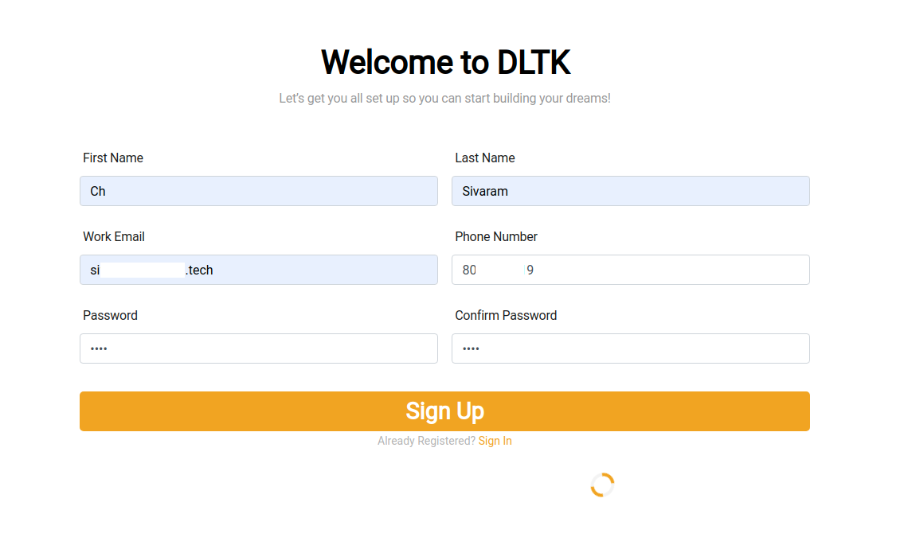
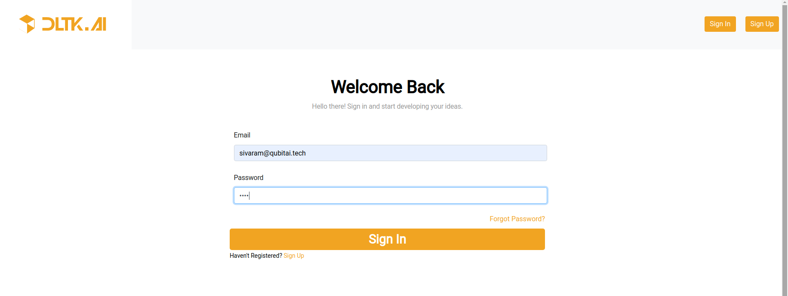

# Authentication 
If you have multiple users using DLTK deployed on common machine, you can enable authentication, to authorize users & track their usage of DLTK services.

## Configure
**SMTP**: To send email to users for email verification, SMTP needs to be configured which can be done in `/usr/dltk-ai/config.env` (linux/mac) or `C:\Users\{username}\AppData\Local\dltk_ai\config.env`(windows)
    
    # SMTP setup
    SMTP_HOST="YOUR_SMTP_HOST"
    SMTP_PORT=587
    SMTP_USERNAME="YOUR_SMTP_USERNAME"
    SMTP_PASSWORD="YOUR_SMTP_USER_PASSWORD"
  
    # UI SERVER URL(replace localhost with server IP in case of remote machine)
    UI_SERVICE_URL="http://localhost:8082"
    


## Enable Authentication
Authentication can be enabled using below command

```commandline
python setup.py --mode auth --auth True
```

This will restart the services with Authentication mode enabled

### User App Creation UI
The UI for user creation can be accessed at [http://localhost:8082]() ,by clicking on `Sign Up` button on top right, user will be able to view below page



After filling above details, click on `Sign Up` button.

User will receive an Email for verification, on successful verification of email, user will be redirected to `Sign In` page.

*Sign In Page*
 

### Create Project & Generate API key
After successful login, user will be able to view project list page
 


Next user needs to create a project, by giving details as shown in below image


After successful creation of project, you can go to Project Details Page to get `API Key`   


### Using API key in SDK
Using above generated API key you can use in python SDK client

```python
import dltk_ai
client = dltk_ai.DltkAiClient('86122578-4b01-418d-80cc-049e283d1e2b', base_url='http://localhost:8000')

text = "The product is very easy to use and has got a really good life expectancy."

sentiment_analysis_response = client.sentiment_analysis(text)

print(sentiment_analysis_response.text)
```

_Expected Output_
```json
{
  "spacy": {"emotion": "POSITIVE", "scores": {"neg": 0.0, "neu": 0.653, "pos": 0.347, "compound": 0.7496}}
}
```

for more detailed information on [Qubitai-DLTK python SDK](https://github.com/dltk-ai/qubitai-dltk) features & usage please refer to this [documentation](https://docs.dltk.ai)

## Disable Authentication

If you want to ***disable*** authentication, below command can be used

```commandline
python setup.py --mode auth --auth False
```

