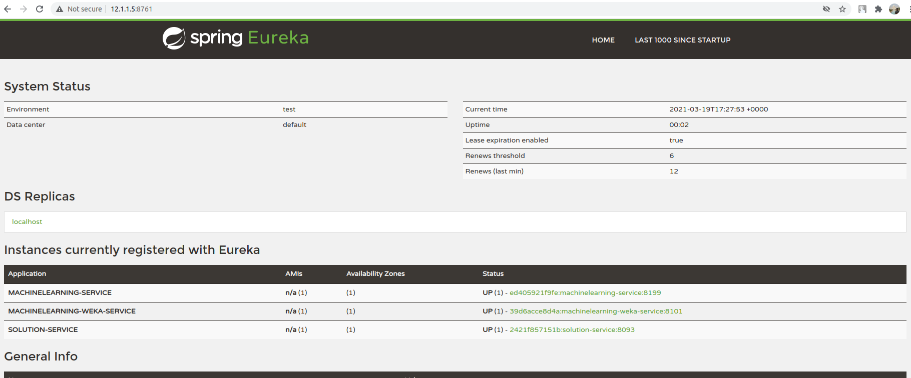

# DLTK - Deep Learning Toolkit 

## What is DLTK?

This Repo contains all the widely used Machine Learning Techniques for Classification, Regression & Clustering,Computer Vision & Natural Language Processing
as Docker Images

This repo contains docker-compose files corresponding to all the Open sourced Docker Images corresponding to ML, Computer Vision & NLP. 
Using these Docker Images developers can make faster AI-enabled prototypes or even production level products.

The development of DLTK is sponsored by QubitAI.

## Introduction 

You can deploy all the open-sourced docker images using docker-compose files provided in this repository  

## Getting Started

### Pre-requisites

1. **Python** (preferably in virtual environments)
   
   To create a virtual environment you can checkout this [link](https://docs.conda.io/projects/conda/en/latest/user-guide/tasks/manage-environments.html#creating-an-environment-with-commands)
2. **Docker**
    [Linux](https://docs.docker.com/engine/install/) ,[Windows Home](https://docs.docker.com/docker-for-windows/install-windows-home/) & [Mac](https://docs.docker.com/docker-for-mac/install/)
 
    To install docker on **linux/mac** run below command 

    ```commandline
    python install_docker.py
    ```  

    for windows you can refer [here](https://docs.docker.com/docker-for-windows/install-windows-home/)

    
3. **Qubitai-DLTK python SDK**

    For installating this SDK you can use `pip install qubitai-dltk`
    On how to use [Qubitai-DLTK python SDK](https://github.com/dltk-ai/qubitai-dltk) please refer to this [documentation]('https://docs.dltk.ai')


### Recommendation

As these deep learning models are computationally expensive, its recommended to run these docker containers on minimum of 16GB RAM machine.
    
### Setup & Configuration

#### 1. Clone Repository

Clone this repository using 
```commandline
git clone https://github.com/dltk-ai/openDLTK
```

#### 2. Initial Configuration

**For Linux/Mac**:
```commandline
sudo python setup.py -m init
```
**For Windows**:
```commandline
python setup.py -m init
```
You can choose version of openDLTK you want to install on your machine.
Please ensure this version should be compatible with the [python client SDK](https://github.com/dltk-ai/qubitai-dltk) you installed above. 

##### Updating Config.env
Please manually update `/usr/dltk-ai/config.env` for linux/mac, `C:\Users\{username}\AppData\Local\dltk_ai\config.env` for windows

For saving datasets, trained models, prediction files following storage are supported by DLTK
 
1. AWS S3 
2. GCS (Google Cloud Storage)
3. DO Spaces (Digital Ocean)
4. Local Disk *(where base container is deployed)*

Storage type can be configured in `/usr/dltk-ai/config.env` (linux/mac) or `C:\Users\{username}\AppData\Local\dltk_ai\config.env`(windows) file, 

**Local Disk** Default STORAGE_TYPE is local
    
    STORAGE_TYPE="local"
    
**AWS S3 :** If you want to setup AWS S3 as primary storage, modify below mentioned keys:
    
    STORAGE_TYPE="aws"
    
    # Values only for reference, replace with your credentials
    
    S3_ACCESS_KEY=AKIAVKNVW3O4G2YSG
    S3_SECRET_KEY=vrJvyZFGSpOFTtZcsDTZTHwJ88Jw
    S3_BUCKET=dltk-ai
    S3_REGION=ap-south-1
    S3_ENDPOINT=https://s3.ap-south-1.amazonaws.com
    
Refer this [link](https://docs.aws.amazon.com/quickstarts/latest/s3backup/step-1-create-bucket.html) for creating a bucket in AWS S3 

**Google Cloud Storage :** To setup Google Cloud Storage as primary storage, modify below mentioned keys:

Replace [base/solution-config/dltk-ai.json](base/solution-config/dltk-ai.json) with your GCS credentials file which you can generate from [GCP service account](https://cloud.google.com/iam/docs/creating-managing-service-accounts) 
    
    STORAGE_TYPE="gcp"
    
    # Values only for reference, replace with your details
  
    GCP_SERVICE_ACCOUNT_FILE=dltk-ai.json
    GCP_PRIVATE_BUCKET=dltk-ai-private
    GCP_PUBLIC_BUCKET=dltk-ai-public

**DO Spaces :** If you want to setup Digital Ocean Spaces as primary storage, modify below mentioned keys:
    
    STORAGE_TYPE="do"
    
    # Values only for reference, replace with your credentials
    
    
    DO_ENDPOINT=sgp1.digitaloceanspaces.com
    DO_ACCESS_KEY=SPZ4OSDVXC35R26
    DO_SECRET_KEY=9b7SQmnFNx0vzAHWc5czKW75By01CH4
    DO_BUCKET=dltk-ai
    DO_REGION=sgp1
    
Refer this [link](https://www.digitalocean.com/docs/spaces/how-to/create/) for creating a bucket in Digital Ocean Spaces 

    

#### 3. Configure supported AI engines credentials

For Natural Language Processing(NLP) if you want to use Azure & IBM services through DLTK you can configure below credentials in `/usr/dltk-ai/config.env` (linux/mac) or `C:\Users\{username}\AppData\Local\dltk_ai\config.env`(windows) file.
    
    AZURE_LANGUAGE_SUBSCRIPTION_KEY=USER_DEFINED
    AZURE_BASE_URL=USER_DEFINED
    
    IBM_LANGUAGE_URL=USER_DEFINED
    IBM_SUBSCRIPTION_KEY=USER_DEFINED
     
For Computer Vision if you want to use Azure & IBM services through DLTK you can configure below credentials in `/usr/dltk-ai/config.env` (linux/mac) or `C:\Users\{username}\AppData\Local\dltk_ai\config.env`(windows) file.
    
    IBM_VISUAL_URL=USER_DEFINED
    IBM_VISUAL_APIKEY=USER_DEFINED
    
    AZURE_VISION_SUBSCRIPTION_KEY=USER_DEFINED
    AZURE_VISION_URL=USER_DEFINED

##### Save configurations

```commandline
python setup.py -m update_config
```
  
### Installation


#### 1. Install required packages/libraries

Run below command to install required libraries/packages
```commandline
pip install -r requirements.txt
```

**For Linux :** Post python `docker` client package installation run below 

1. Create the docker group : `sudo groupadd docker`

2. Add the user to the docker group: `sudo usermod -aG docker $(whoami)`

3. Log out and log back in to ensure docker runs with correct permissions. (if on server, please reboot the server)

4. Start docker: `sudo service docker start` (in linux)

**For Windows/Mac:**: By default this is enabled


#### 2. Start Installation Process

Next step is to `cd` to directory containing `setup.py` file and use below command to start installation process.

```commandline
python setup.py --mode install
```

you will get a list of service as shown below, choose the services you want to install using comma separated Ids.

    Please choose services you want to install from below list
            1. Base
            2. ML Scikit
            3. ML H2O
            4. ML Weka
            5. Image Classification
            6. Object Detection
            7. Face Analytics
            8. Natural Language Processing

    Note: Image Classification,Object Detection and Face Analytics may take an hour to download.
            
    Choose your selection : 5, 8(for example)

This will install all the required docker containers on your machine for _Image Classification_ & _Natural Language Processing_ services

You can verify whether installation is successful or not by visiting [http://localhost:8761]() (Registry service) to check status of containers




#### 3. Using Client SDK
[Qubitai-DLTK python SDK](https://github.com/dltk-ai/qubitai-dltk) can be used as a client interface to use DLTK features/service

**Reference usage:**

```python
import dltk_ai
client = dltk_ai.DltkAiClient('YOUR_API_KEY', base_url='http://localhost:8000')

text = "The product is very easy to use and has got a really good life expectancy."

sentiment_analysis_response = client.sentiment_analysis(text)

print(sentiment_analysis_response.text)
```

Important Parameters:

**1. API key:**
If authentication is disabled(default), no need to change 'YOUR_APIKEY' input, but if authentication is enabled you need to provide a valid APIkey. 

For more details on authentication enabling please refer to [Authentication Documentation](docs/auth.md)

**2. base_url:**
base_url is the url of the machine where base service is installed by _default_ its localhost, so base_url needs to be [http://localhost:8000]()

_Expected Output_
```json
{
  "spacy": {"emotion": "POSITIVE", "scores": {"neg": 0.0, "neu": 0.653, "pos": 0.347, "compound": 0.7496}}
}
```

Also for more detailed information on [Qubitai-DLTK python SDK](https://github.com/dltk-ai/qubitai-dltk) features & usage please refer to this [documentation](https://docs.dltk.ai) 

#### 4. Authentication (*optional*):

You can ***enable*** and ***disable*** authentication in dltk.

For more details on authentication please refer to this [link](docs/auth.md)

### Uninstall

**Option 1: Stop/Uninstall a service**

a. If you wish to stop a service for now but use it later, using below command a particular service can be stopped

```commandline
python setup.py --mode uninstall --partial --remove
```

b. If you don't want to use this service in future, then along with running containers, docker images can also be removed, using below command

```commandline
python setup.py --mode uninstall --partial --purge
```

**Option 2: Complete Uninstallation**

a. If you wish to only stop all the DLTK containers but ***retain docker images*** for future usage, you can use below command

```commandline
python setup.py --mode uninstall --all --remove
``` 

b. If you wish to completely remove all the DLTK's docker container & images, use below command

```commandline
python setup.py --mode uninstall --all --purge
```


### Issues
If you face any issue you can raise them [here](https://github.com/dltk-ai/open-source-containers/issues) 


### Licenses
The content of this project itself is licensed under [GNU LGPL, Version 3 (LGPL-3)](https://github.com/dltk-ai/dltkai-sdk/blob/master/python/LICENSE)